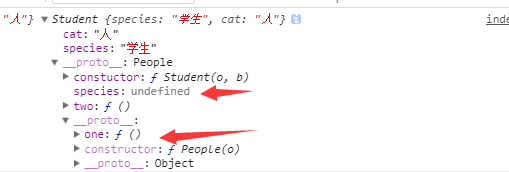
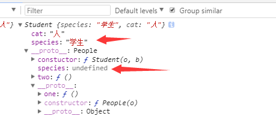

# js的继承问题
> 继承问题 2018.04.21

### `prototype` 和 `__proto__`
-----
学继承之前，势必先谈下`prototype`和`__proto__`，在js中什么都是对象（我的理解），全局api是一个大的对象属性。
- `__proto__`
	对象具有属性`__proto__`，可称为隐式原型,方法是对象，所以也具有`__proto__`这个属性，这个属性是一个指针，指向构造函数的prototype，也就是这个意思
	
```javascript
function Person(){
}
Person.prototype.one=function(){
}
Person.prototype===new Person().__proto__ //true
```
	
- `prototype`
	谈这个势必会先了解到方法 也就是`Function`,每一个方法都会有`prototype`这个属性,`prototype`指向原型对象。
	有一张有趣的图[]
	
> 能看懂这个图，对原型链基本就没问题了，至此以上话题就到此结束

### js继承 es5实现
简单的也就不谈了，构造函数什么的，大家都懂，直接进入正题
对于es5实现继承是通过原型的继承
先来两个函数
```javascript
// es5实现继承
function People(o) {
    this.species = o;
}
People.prototype.one = function() {
    console.log(1)
}
function Student(o,b) {
    this.cat = b
}
```
先谈原型继承也就是利用原型链，如以下代码所示
```javascript
Student.prototype = new People() 
//注意上一行为重写propotype，constructor的指向会变成People（原本指向Student）
// 所以需要将指针重新定向为 Student
Student.prototype.constructor = Student
// 重写后Enumenrable特性变为true
//es5可以使用defineProperty
//即 Object.definePropertype(Student.prototype,'constructor'{
//	Enumenrable:false,
//	value:Student
//})
Student.prototype.two = function(){
	console.log(2)
}
```
谷歌控制台截图如下


下面一种比较简单的 借用构造函数继承（有时候也叫伪造对象和经典继承）但是只能继承构造函数内部的属性，不能继承原型链
```javascript
// 重写Student
function Student(o,b){
	Person.call(this,b)
	this.cat = o
}
```


综合以上两者的优缺点，也就有了组合继承
> 组合继承

```javascript
function People(o) {
    this.species = o;
}
People.prototype.one = function() {
    console.log(1)
}
function Student(o, b) {
    People.call(this, b)
    this.cat = o
}
Student.prototype = new People()
Student.prototype.constuctor = Student
Student.prototype.two = function() {
    console.log(2)
};
console.log(new People('人'), new Student('人', '学生'))
```
如下图


组合继承的缺点就是，无论如何都会调用两次父类，子类型最终会包含父类的全部实例属性，这样是非常耗内存的


由于以上种种，也就衍生除了寄生组合式继承
寄生的意思是利用一个空构造函数原型先继承父类原型，然后子类继承 空构造函数实例

```javascript
function People(o) {
    this.species = o;
}
People.prototype.one = function() {
    console.log(1)
}
function Student(o, b) {
    People.call(this, b)
    this.cat = o
}
function f(){}
f.prototype = People.prototype
Student.prototype = new f()
Student.prototype.constuctor = Student
Student.prototype.two = function() {
    console.log(2)
};
console.log(new People('人'), new Student('人', '学生'))
```
如下图


>  现在es5继承基本完美了
 
 当然，如果学习过es6的话，在es6中是非常简单的
 想了解的自己可以去看看[《es6入门经典》](http://es6.ruanyifeng.com/ "es6入门经典")
 
###  结语
觉得不错的可以给个star，谢谢
感觉了解的还是不够透彻
如果想了解更多的话，可以去[《阮一峰老师 构造函数继承》](http://www.ruanyifeng.com/blog/2010/05/object-oriented_javascript_inheritance.html "阮一峰老师 构造函数继承")
[js中__proto__和prototype的区别和关系](https://www.zhihu.com/question/34183746 "js中__proto__和prototype的区别和关系")
感谢以上文章
