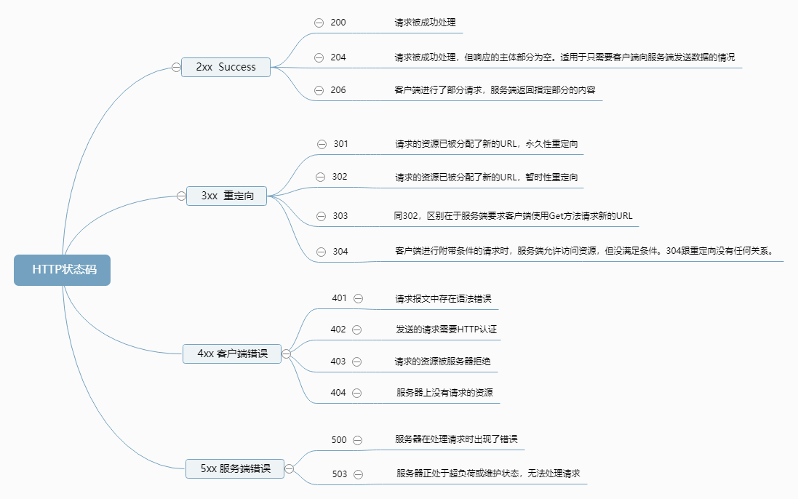

# 纪录收集的面试题


### css
-----
1. **BFC**
    块级格式化上下作用域

### js
-----
1. **get请求传参长度误区**  
   ***get参数的大小不存在限制，而post请求的参数大小是无限制的***
   实际上http从未规定get/post 的请求长度限制是多少，对于get请求参数的来源是浏览器和web服务器，浏览器和web服务器限制了URl的长度
2. **闭包**  
    闭包就是能够读取其他函数内部变量的函数，或者子函数在外调用，子函数所在的父函数的作用域不会被释放。
    使用用途有，创建私有变量
3. **继承**  
    肯定就要讲到原型链了，原型链的终点是object.prototype prototype只有构造函数才有
4. **js异步**  
    promise generator/yield async/await   
    这里必要谈到promise的实现
    ```js
    function promise(reslove,reject)
    ```
5. **JavaScript 异步、栈、事件循环、任务队列**
    
6. **作用域链**

    当查找变量的时候，会先从当前上下文中的变量对象中查找，如果没有找到，就会从父级执行上下文的变量对象中查找，一直找到全局上下文的变量对象，也就是全局对象，这样由多个执行上下文的变量对象构成的链表就叫做作用域链

7. **内存泄漏**  
    内存泄漏就需要说到内存的回收机制，栈内存，堆内存
    值类型的数据存在栈内存，对象类型的数据将指针存在栈内存，将数据存在堆内存，当不存在指针指向堆内存的数据时，该数据被销毁了
    > 意外的产生的全局变量不会被销毁
    > 闭包引起的内存泄漏，使用完定时清理变量，被遗忘的定时器回调

8. **说说你对promise的了解**  
    以我的认识,因为js是一门单线程语言，以前为了实现异步都是使用回调函数，现在使用promise  
    promise是可以链式调用的，promise的实现,promise.all的实现
9. **webpack**  
    讲到webpack的时候可以提到公司的模板渲染引擎
    webpack-parallel-uglify-plugin多线程压缩代码
    happyPack亲身尝试，好像并没有什么大的效果提升，多进程编译代码
    还有就是动态连接库，如果使用到模板引擎，可以编写一个loader插件，使得模板变成一个`function`，function的速度比正则替换更快
    mini-css-extract-plugin
    mode，optimization
    CopyWebpackPlugin 这里可以使用linux脚本中的rm命令，更加快速，如果为了兼容windows的话，最好还是用CopyWebpackPlugin，在windows下报一堆的问题

10. **提升白屏体验**

    Skeleton Screen也就
    是在页面完全渲染之前先使用这个样式简单的，描绘了当前页面的大致框架 
    loading加载
11. **深拷贝和浅拷贝**  
    栈内存和堆内存
12. **分而制之**  

13.  **ES6 的语法应用（promise async await 等）**

    知道哪些都全部说出来
14. **数组去重**

    es5实现方法,这里利用了es5
    ```js
        function nonDup(arr){
            var res = [];
            for(var i = 0; i < arr.length; i++) {
                if(res.indexOf(arr[i]) === -1) {
                    res.push(arr[i]);
                }
            }
            return res;
        }
        function nonDup(arr){
            return arr.filter((elem, index) => {
                return index === arr.indexOf(elem);
            });
        }
    ```
    es6实现方法
    ```js
    function nonDup(arr){
        var res = new Set(arr)
        return [...res]
    }
    ```
15. **bind实现**
    ```js
    Function.prototype.bind = function (that) {
        var self = this
        var slice = Array.prototype.slice
        var arr = slice.call(arguments,1)
        return function () {
            self.apply(that, [...arr, ...arguments])
        }
    }
    ```
16. **promise.all实现**
    ```js
    function all(arr) {
        let length = arr.length
        let count = 0
        <!-- 创建出length个内存区 -->
        let arrs = new Array(length)
        return new Promise((resolve, reject) => {
            arr.forEach((item, index) => {
                item(index).then(function (res) {
                    arrs[index] = res
                    count++
                    if (count === length) {
                        resolve(arrs)
                    }
                }, function (err) {
                    reject(err)
                })
            });
        })
    }
    ```
### 设计模式模式
    单例模式  闭包
    策略模式  
    代理模式  图片懒加载
    中介者模式  
    装饰者模式 aop  在不改变对象自身的基础上，在程序运行期间给对象动态地添加方法。

### http缓存机制
_____

缓存分为两种 强缓存和弱缓存

http状态码


> 讲优化的时候可以谈缓存啊，懒加载啊，将内容放到下一帧去执行，合并http请求，为什么要合并啊，是不是合并的越多越好啊！这里就要谈谈请求头了，还有tcp建立连接的问题，小图片，小数据之类的东西最好合并，也就是雪碧图，数据在整体发送到服务端的包比较小，header请求头占了一大部分  

etag if-none-matched 
